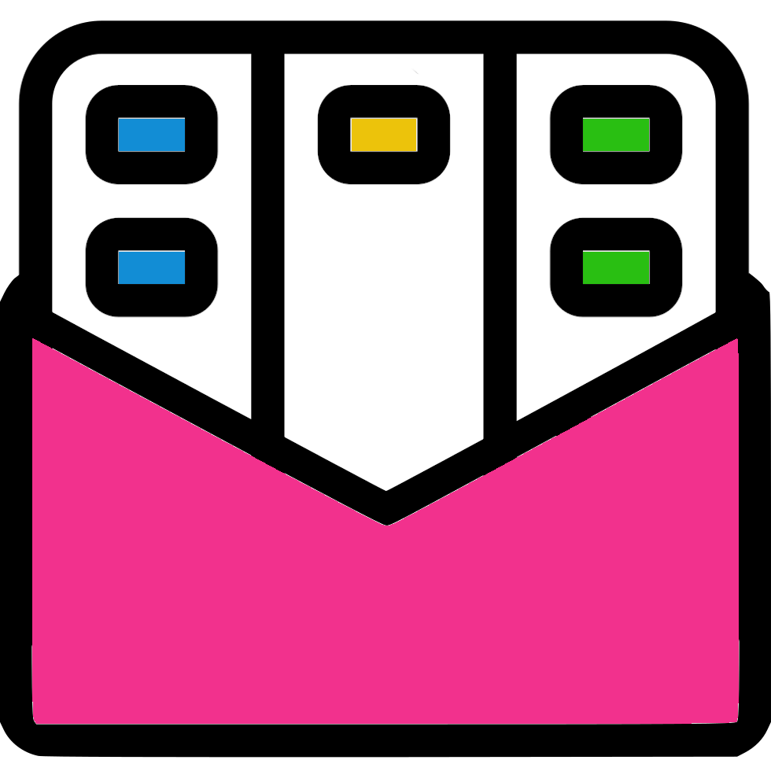

<h1>
    
    Kanmail
</h1>

An email client that functions like a kanban board, for Mac/Windows/Linux/Docker. [**Download the latest release here**](https://kanmail.io/download).


The rest of this readme focuses on the technical details of Kanmail. For user documentation [**see the `docs` directory**](./docs).

## Technical Details

+ Build on MacOS (beta), tested with Linux & Windows (alpha)
+ Developed using Gmail, Outlook & Fastmail
+ Should be compabile with other email providers (uses IMAP/SMTP)
+ Python server / JavaScript web interface
+ Considered in "beta" - used as my main email client for >1yr

## Development

### Setup your system

#### MacOS

Python _must_ be configured `--with-framework`. See [this StackOverflow answer](https://stackoverflow.com/a/15752676/352488) to to check whether this is enabled.

To build/release you'll need to intsall GNU tar, which can be done with brew:

```
brew install gnu-tar
```

### Linux (Ubuntu)

For `qt` to install properly you'll need:

```
apt install build-essential pkg-config git python3-dev libcairo2-dev libgirepository1.0-dev
```

Then, _after_ requirements are installed you need to edit [this pyinstaller file](https://github.com/pyinstaller/pyinstaller/blob/develop/PyInstaller/hooks/hook-gi.repository.Gtk.py#L24) and comment out the lines that add fontconfig/icons/themes (prevents the resultant bundle being >200mb).

#### Windows

You'll need the [Visual Studio build tools](https://visualstudio.microsoft.com/downloads/).


### Install Python requirements

First install the requirements:

```
# Generic development requirements
pip install -r requirements/development.txt

# Platform specific requirements
pip install -r requirements/[macos|linux|windows].txt
```

To start the server + webpack-server:

```
honcho start
```

Then go to [http://localhost:4420](https://localhost:4420) to view/develop the app in a browser of your choice.

Or - to start the full windowed app, use:

```
honcho start -f Procfile-app
```

Note that the webserver does not auto-reload when running in app mode.


### Releases

Version numbers are generated at build in the date-based format: `MAJOR.YYMMDDhhmm`.


## Syncing

Kanmail syncs email using the IMAP protocol. Instead of implementing a "complete sync engine" (one which attempts to keep a local copy of the server data), Kanmail uses a cache and loads data on demand. This simplifies the implementation but makes it hard/impossible to behave as an offline email client.

Kanmail keeps in sync with the remote server by checking UID lists. These are cached locally and every "sync" the full list is refreshed, ensuring the local copy is up to date with the server UID list. Email headers are cached against their UIDs.

Currently no actual full email data is cached, only the headers. Meaning when offline Kanmail will load any cached threads into the column view, but it won't be able to open any of these threads.

### Initial load (get emails)

When Kanmail starts, the UI attempts to get emails for each folder (both columns and "core" folders like archive/drafts) - this API endpoint is always expected to return a valid response, even if empty, and does not require connectivity. If there is a local cache of UIDs and email headers, these will be returned.

Subsequent calls to this API endpoint will load more emails, loading headers from the server as required.

### Updates (sync emails)

During the lifetime of a running Kanmail app it will periodically request to sync emails with the server. At this time the full UID list is reloaded from the server (failing if offline) and any new email headers are fetched. This endpoint returns new emails and the UIDs of any deleted emails from the UID list.
