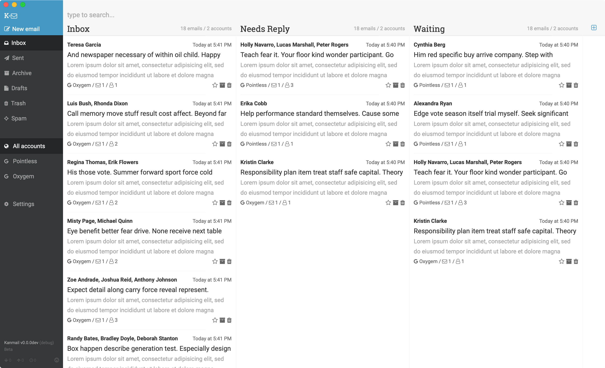

<h1>
    
    Kanmail
</h1>

An email client that functions like a kanban board, for Mac/Windows/Docker. [**Download the latest release here**](https://kanmail.io/download).



+ Works on MacOS, Windows & Docker (see [Linux support issue](https://github.com/Oxygem/Kanmail/issues/140))
+ Developed using Gmail, Outlook & Fastmail
+ Should be compatible with [other email providers](https://kanmail.io/docs/email-providers) (uses IMAP/SMTP)
+ Considered in "beta" - used as primary email client for >1yr

The rest of this readme focuses on the technical details of Kanmail. For user documentation [**see the Kanmail website**](https://kanmail.io/docs).

+ [License](#license)
+ [Development](#development)
    * [Setup your system](#setup-your-system)
    * [Install requirements](#install-requirements)
    * [Start the app](#start-the-app)
+ [Building](#building)
    * [Build environments](#build-environments)
    * [Doing a build](#doing-a-build)
+ [Syncing](#syncing)
+ [User Interface](#user-interface)

## License

Before continuing it is important to note that Kanmail is **source available but not free**. Kanmail is available for free download for evaluation; for continued use of Kanmail a [**license should be purchased**](https://kanmail.io/license).

We welcome pull requests, but note you will be contributing to a non-free project. You will be required to sign [the Oxygem CLA](https://gist.github.com/Fizzadar/6093499cccdcac7a4d83698516f9cafa) before any contributions can be merged. We offer free license keys to contributors, please email [hello@oxygem.com](mailto:hello@oxygem.com) for more information.

## Development

### Setup your system

#### MacOS

Python _must_ be configured `--with-framework`. See [this StackOverflow answer](https://stackoverflow.com/a/15752676/352488) to check whether this is enabled.

To build/release you'll need to install GNU tar, which can be done with brew:

```
brew install gnu-tar
```

#### Windows

You'll need the [Visual Studio build tools](https://visualstudio.microsoft.com/downloads/).

#### Linux (Ubuntu)

For `gtk` to install properly you'll need:

```
apt install build-essential pkg-config git python3-dev libcairo2-dev libgirepository1.0-dev
```


### Install requirements

#### Python

Kanmail requires Python `3.7` and uses `pip-tools` to manage requirements. There's a wrapper script to handle installing/updating requirements:

```
python -m make.requirements install [--dev]
```

#### JavaScript

Install the JavaScript requirements with `yarn`:

```
yarn install
```

### Start the app

#### Run as a server

To start the server + webpack-server:

```
honcho start
```

Then go to [http://localhost:4420](https://localhost:4420) to view/develop the app in a browser of your choice.


#### Run as an app

To start the full windowed app, use:

```
honcho start -f Procfile-app
```

Note that the webserver does not auto-reload when running in app mode.


### Releases

Version numbers are generated at build in the date-based format: `MAJOR.YYMMDDhhmm`.

## Building

Per the [pyinstaller documentation](https://pyinstaller.readthedocs.io/en/stable/usage.html#platform-specific-notes), for maximum compatability Kanmail is ideally built on the _oldest_ systems available. MacOS + Linux builds are forward, but not backward, compatible.

Kanmail is currently built on:

+ MacOS 10.15 (using 10.10 SDK), compatible with 10.10+
+ Ubuntu 18 64 bit, compatible with libc6 2.27+
+ Windows 10 64 bit, compatible with ?

### Build environments

#### MacOS

Should use the oldest SDK possible. Kanmail will be compatible with the SDK version of any newer versions, but nothing older, so target the oldest realistic SDK, which is currently 10.10 / Sierra. Heavily based on [this gist](https://gist.github.com/phfaist/a5b8a895b003822df5397731f4673042).

+ Use [xcodelegacy](https://github.com/devernay/xcodelegacy) to download old OSX SDK files

##### Setup a separate environment

```sh
export BUILD_ENV_PREFIX=/opt/osx10.10-env

export PATH="$BUILD_ENV_PREFIX/Frameworks/Python.framework/Versions/Current/bin:$BUILD_ENV_PREFIX/bin:/usr/bin:/bin:/usr/sbin:/sbin:/opt/X11/bin"

export MACOSXSDK=/Applications/Xcode.app/Contents/Developer/Platforms/MacOSX.platform/Developer/SDKs/MacOSX10.10.sdk

export MACOSX_DEPLOYMENT_TARGET="10.10"

export CFLAGS="-isysroot $MACOSXSDK  -I$MACOSXSDK/System/Library/Frameworks/Tk.framework/Versions/8.5/Headers -I$BUILD_ENV_PREFIX/include "
export LDFLAGS="-isysroot $MACOSXSDK -L$BUILD_ENV_PREFIX/lib "
export LD_LIBRARY_PATH="$BUILD_ENV_PREFIX/lib/"
export CXXFLAGS="-isysroot $MACOSXSDK -I$BUILD_ENV_PREFIX/include "
export CPPFLAGS="-I$MACOSXSDK/usr/include -I$BUILD_ENV_PREFIX/include -I$BUILD_ENV_PREFIX/include/openssl "
```

##### OpenSSL

Download & untar `openssl-1.0.2u`. **On an amd64 Mac:** prefix these commands with `arch -x86_64`.

```sh
./Configure --prefix=$BUILD_ENV_PREFIX \
    no-hw no-hw-xxx no-ssl2 no-ssl3 no-zlib zlib-dynamic \
    shared enable-cms darwin64-x86_64-cc enable-ec_nistp_64_gcc_128 \
    -isysroot$MACOSXSDK \
    -mmacosx-version-min=$MACOSX_DEPLOYMENT_TARGET
make depend
make
make install
```

##### Python

Download & untar Python. **On an amd64 Mac:** prefix these commands with `arch -x86_64`.

```sh
./configure --prefix=$BUILD_ENV_PREFIX/ \
    --enable-ipv6 \
    --enable-framework=$BUILD_ENV_PREFIX/Frameworks/ \
    --with-openssl=$BUILD_ENV_PREFIX \
    MACOSX_DEPLOYMENT_TARGET="$MACOSX_DEPLOYMENT_TARGET"
make
make install PYTHONAPPSDIR=$BUILD_ENV_PREFIX/Applications

# Tidy up
cd $BUILD_ENV_PREFIX/Frameworks/Python.framework/Versions/Current/bin
ln -s python3 python
ln -s pip3 pip
```

Finally install the requirements (from source, no binaries):

```sh
pip install pip -U
pip install -r requirements/macos.txt
```

Using this environment should now build apps compatible with MacOS 10.10+. This can be tested by [installing a MacOS 10.13 VM](https://www.howtogeek.com/289594/how-to-install-macos-sierra-in-virtualbox-on-windows-10/).

#### Linux (Ubuntu)

Should use the oldest libc possible. Currently building using Ubuntu 18 which has libc6 2.27, which is pretty recent.

TBC instructions to build on an older libc.

#### Windows

Currently builds on Windows 10. Unsure if compatible with previous versions.

### Doing a build

Building Kanmail should be as simple as running `python -m make`.


## Syncing

Kanmail syncs email using the IMAP protocol. Instead of implementing a "complete sync engine" (one which attempts to keep a local copy of the server data), Kanmail uses a cache and loads data on demand. This simplifies the implementation but makes it hard/impossible to behave as an offline email client.

Kanmail keeps in sync with the remote server by checking UID lists. These are cached locally and every "sync" the full list is refreshed, ensuring the local copy is up to date with the server UID list. Email headers are cached against their UIDs.

Currently no actual full email data is cached, only the headers. Meaning when offline Kanmail will load any cached threads into the column view, but it won't be able to open any of these threads.

### Initial load (get emails)

When Kanmail starts, the UI attempts to get emails for each folder (both columns and "core" folders like archive/drafts) - this API endpoint is always expected to return a valid response, even if empty, and does not require connectivity. If there is a local cache of UIDs and email headers, these will be returned.

Subsequent calls to this API endpoint will load more emails, loading headers from the server as required.

### Updates (sync emails)

During the lifetime of a running Kanmail app it will periodically request to sync emails with the server. At this time the full UID list is reloaded from the server (failing if offline) and any new email headers are fetched. This endpoint returns new emails and the UIDs of any deleted emails from the UID list.


## User Interface

The Kanmail UI consists of a collection of React apps, one per window "category".

### EmailsApp

The main Kanmail window, including the column and email thread views. This is where the interesting stuff lives!

#### Column / thread renders

Rendering columns can be expensive, so Kanmail uses a few "hacks" to reduce the amount of renders required. For example, when archiving or trashing a thread, it's hidden from the user but the underlying component remains in-place. Only the thread component itself updates and the surrounding column does not re-render.

#### Keyboard navigation

Kanmail supports navigating between threads _and_ between columns using the keyboard. To achieve this every thread component contains a reference to access the component above/below (other threads same column) and also the adjacent columns left/right. This is achieved using React references.

### SendApp

The send/reply/forward email window and editor.

### SettingsApp

The settings window. Handles account management as well as general application settings.

### ContactsApp

The contacts window. Handles add/remove/delete contacts API.

### LicenseApp

The license window. Add/remove a license key.

### MetaApp

The meta/about window, includes license information.
