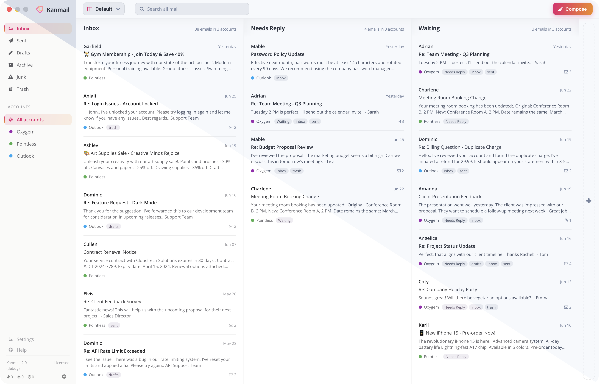

<h1>
    
    Kanmail
</h1>

An email client that turns your inbox into a kanban board, for Mac/Windows/Linux. [**Download the latest release here**](https://kanmail.io/download).

> [!IMPORTANT]
> Please note that Kanmail is **source available but not free**. Kanmail may be downloaded and evaluated for free; for continued use of Kanmail a [**license must be purchased**](https://kanmail.io/license).

<picture>
  <source srcset=".github/screenshots/kanmail-dark.webp" media="(prefers-color-scheme: dark)">
  
</picture>

## Contributions

We welcome pull requests, but be aware you will be contributing to a non-free project. You will be required to sign [the Oxygem CLA](https://gist.github.com/Fizzadar/6093499cccdcac7a4d83698516f9cafa) before any contributions can be merged. We offer free license keys to contributors, please email [hello@oxygem.com](mailto:hello@oxygem.com) for more information.
